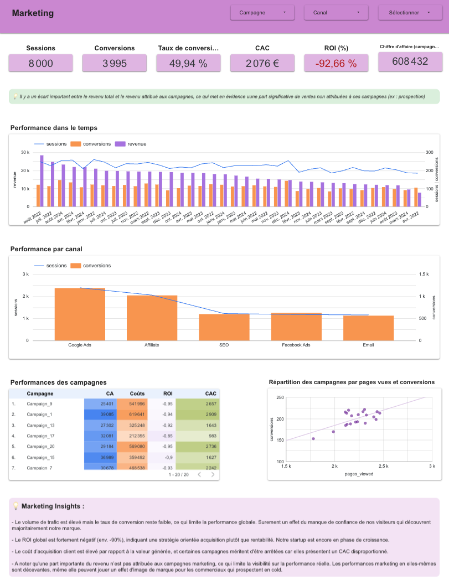
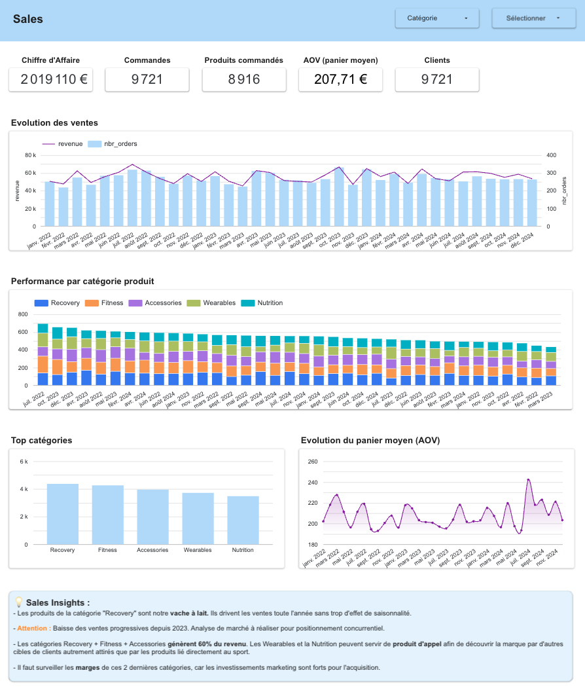
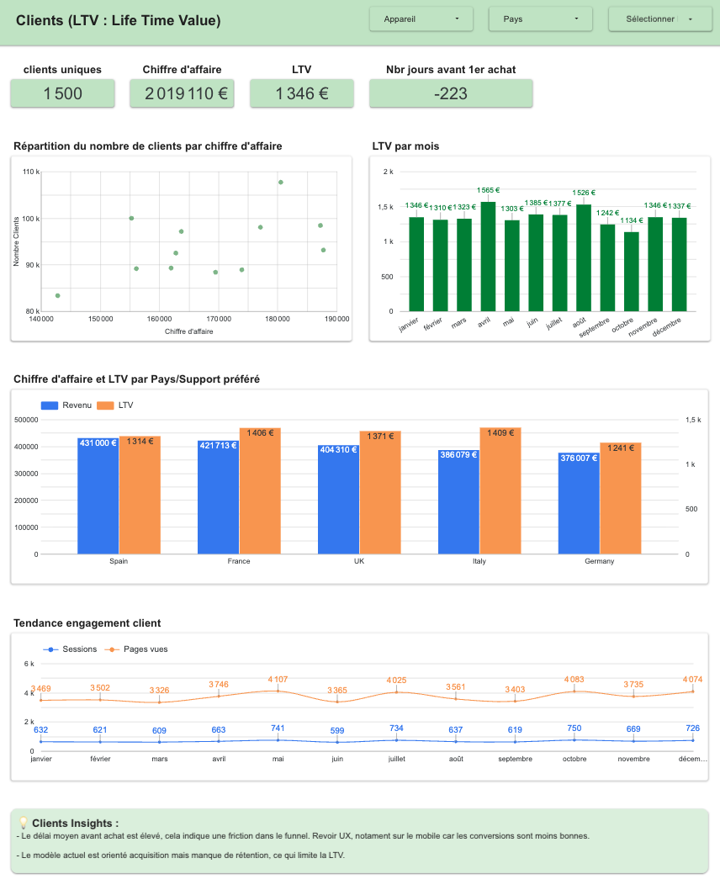

# 📊 Digital Marketing & E-commerce Analytics Project

## 🚀 Project Overview

This project simulates the data environment of a **B2C e-commerce startup** and demonstrates end-to-end data analytics skills, from data generation to business insights.

It is designed to showcase practical competencies in:
- Data modeling
- SQL analytics
- Marketing & sales performance analysis
- Dashboarding

---

## 🧩 Project Architecture

The project is structured in three main layers:

### 1. Data Generation (Python)
A Python script generates realistic synthetic data for a startup over a **2-year period**, including:

- Customers
- Products
- Orders & order items
- Website sessions
- Marketing campaigns & channels

The dataset is designed to reflect real-world business scenarios:
- Multi-channel acquisition
- Conversion funnel
- Revenue generation
- Customer behavior

---

### 2. Data Warehouse (BigQuery)

All datasets are stored and queried in Google BigQuery.

#### Data Modeling

Three main **analytical views (data marts)** are created:

- `view_daily_campaigns_performance` → marketing performance  
- `view_daily_product_sales` → product & sales performance  
- `view_customer_cohorts` → customer behavior & LTV  

These views are built using SQL transformations and follow best practices:
- Aggregation by business entity (day, product, customer)
- Avoiding duplication issues
- Clear separation of concerns (marketing / sales / customer)

---

### 3. SQL Analytics

The project includes a collection of SQL queries organized by topic and difficulty:
queries/
├── 01_acquisition
├── 02_conversion_funnel
├── 03_sales_analysis
├── 04_customer_analysis
├── 05_ltv_cohort_analysis
├── 06_campaign_performance
├── 07_product_analysis
└── 08_advanced_segmentation

These queries cover:

- Traffic analysis
- Conversion funnel analysis
- Revenue breakdown
- Customer segmentation
- Cohort analysis
- Marketing ROI & CAC

They are designed to demonstrate:
- Joins across multiple tables
- Aggregations and window functions
- Business-oriented metrics

---

## 📈 Dashboard

An interactive dashboard was built using Looker Studio:

👉 https://lookerstudio.google.com/reporting/64d417ca-4d1a-42d4-ad6d-6255baa3dd0d

### Dashboard Sections

#### 🔹 Marketing Performance

#### 🔹 Sales Performance

#### 🔹 Customer Analytics

---

## 🛠️ Tech Stack

- Python (data generation)
- SQL (analysis & transformations)
- Google BigQuery (data warehouse)
- Looker Studio (dashboarding)
- GitHub (version control)

---

## 🎯 Project Goals

This project aims to demonstrate the ability to:

- Design a realistic data model for a business use case  
- Write advanced SQL queries for analytics  
- Translate data into actionable business insights  
- Build clear and impactful dashboards  

---

## 📌 How to Use This Project

1. Generate the dataset using the Python script  (terminal : python run gen_data_script.py)
2. Upload data to BigQuery  
3. Run SQL queries to create analytical views  
4. Connect views to Looker Studio  
5. Explore insights through the dashboard  

---

## 💡 About

This project was built as part of a **data analytics portfolio**, with a focus on marketing and business performance.

It reflects real-world challenges such as:
- Data modeling trade-offs  
- Attribution issues  
- Performance analysis across multiple business dimensions  